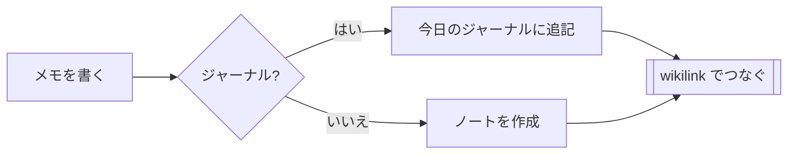
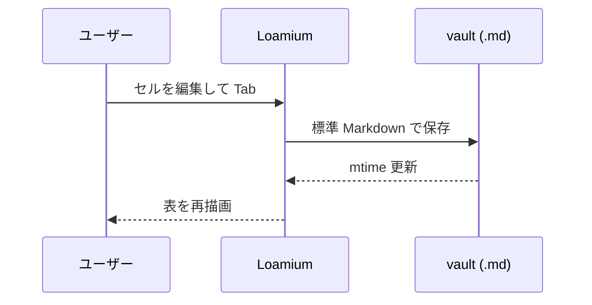

# mermaid 図

言語名を `mermaid` にしたコードフェンスで、フローチャートやシーケンス図を描画できます。

## フローチャート

```mermaid
flowchart LR
  A[メモを書く] --> B{ジャーナル?}
  B -- はい --> C[今日のジャーナルに追記]
  B -- いいえ --> D[ノートを作成]
  C --> E[[wikilink でつなぐ]]
  D --> E
```

## シーケンス図

```mermaid
sequenceDiagram
  participant U as ユーザー
  participant L as Loamium
  participant V as vault (.md)
  U->>L: セルを編集して Tab
  L->>V: 標準 Markdown で保存
  V-->>L: mtime 更新
  L-->>U: 表を再描画
```

## ポイント

- 図はクリックするとソース編集に戻れます
- 挿入は [[スラッシュメニュー]] の `/mermaid` が便利です
