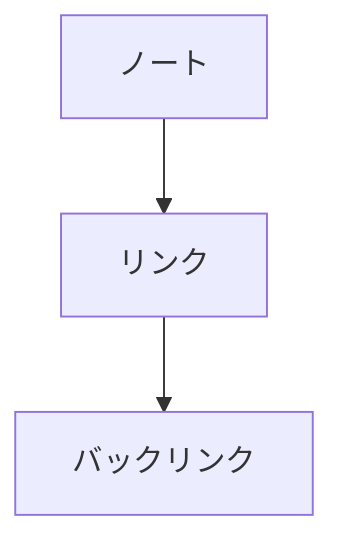

# Mermaid 図

` ```mermaid ` のコードフェンスは図として描かれます。



- **フェンスはそのまま残ります。** 図は表示だけで、ファイルに書かれるのは Mermaid のテキストです
- 図にマウスを乗せる (モバイルはタップする) と、右上に操作バーが出ます
  - **編集** — Mermaid のテキストが出ます (キャレットは末尾)。書き換えるたびに図が描き直されます
  - **画像をコピー** — 描かれた図を PNG としてクリップボードへ
  - **テキストをコピー** — Mermaid のソースをコピーします
- 図の外をクリックすればテキストは畳まれます
- 書き方が間違っているときは、消さずに赤いメッセージを出します
- `/Mermaid` から雛形を挿入できます

Mermaid 本体は**図があるノートを開いたときだけ**読み込みます(重いので、無いノートでは読み込みません)。
