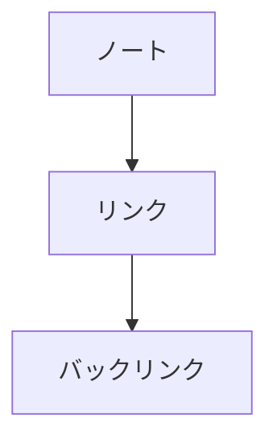

# Mermaid 図

` ```mermaid ` のコードフェンスは図として描かれます。



- **フェンスはそのまま残ります。** 図は表示だけで、ファイルに書かれるのは Mermaid のテキストです
- カーソルをフェンスの中に置くとテキストが出て、書き換えながら図の変化を見られます
- 書き方が間違っているときは、消さずに赤いメッセージを出します
- `/Mermaid` から雛形を挿入できます

Mermaid 本体は**図があるノートを開いたときだけ**読み込みます(重いので、無いノートでは読み込みません)。
